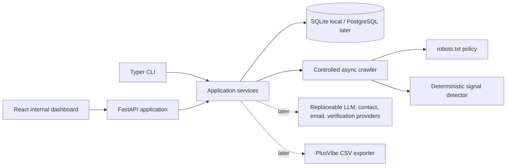

# VoyageAge Lead Miner v0.1

Internal sales intelligence for turning public company websites into qualified, reviewable B2B leads. The tool is isolated from VoyageAge production and does not send email.

Phases 1 and 2 provide the project foundation plus a bounded, robots-aware public website crawler. The system normalizes and deduplicates companies, crawls a limited set of high-value pages, extracts clean page metadata, detects deterministic AI/LLM/provider/model signals, preserves concise evidence, and exposes results through the API, CLI, and React dashboard. Scoring, semantic analysis, provider-backed contact enrichment, verification, personalization, and PlusVibe export remain later phases.

## Current progress

Status as of August 2026:

- **Phase 1 — Foundation: complete.** Isolated Python/FastAPI and React project, SQLAlchemy models, SQLite/PostgreSQL-ready configuration, domain normalization, provenance-aware CSV/manual/batch import, suppression foundations, API/CLI patterns, and dashboard shell.
- **Phase 2 — Website crawler and deterministic AI signals: complete.** Async bounded crawling, robots awareness, URL prioritization, conservative domain policy, HTML extraction, page/evidence/public-email persistence, provider/model/SDK/concept detection, confidence contexts, recrawl caching, content deduplication, API/CLI batch operations, and crawl review UI.
- **Phase 3 — VoyageAge fit scoring and optional semantic qualification: not started.** Requirements have been defined, but no scoring or LLM-backed analyzer is implemented yet.
- **Phase 4+ — Contacts, verification, personalization, and export: not started.** No contact enrichment or outbound email capability exists in the application.

Current verification baseline:

- Backend regression suite: **40 tests passed**.
- Ruff lint and format checks: passed.
- Frontend ESLint and production build: passed.
- Browser QA: desktop and mobile dashboard, crawl action/status polling, company detail, evidence, page errors, empty states, and clean browser console.
- Limited live crawler QA completed against OpenRouter, Anthropic, LangChain, Hugging Face, Stripe, and OpenAI with conservative rate/page limits.

The project remains completely isolated from the VoyageAge production application, API gateway, and deployment configuration.

## Architecture



The backend is a modular monolith. External services will sit behind provider interfaces and never leak vendor-specific response shapes into core models. Local SQLite uses the same SQLAlchemy 2 model layer intended for PostgreSQL. Phase 1 creates tables directly; schema migrations will be introduced before the first shared/PostgreSQL deployment.

## Repository layout

```text
backend/leadminer/
  api/                 FastAPI routes and validated schemas
  crawler/             URL policy, fetcher, extraction, robots, orchestration
  models/              SQLAlchemy entities and lifecycle enums
  services/            normalization and import business logic
  signals/             centralized patterns and context-aware detector
frontend/src/
  components/          reusable app-shell UI
  features/companies/  lead table and import workflow
tests/                 isolated, no-credit tests
docs/design/           dashboard concept used as the visual spec
examples/              safe import fixture
```

## Installation

Requirements: Python 3.12+, Node.js 20+ and npm. `uv` is optional; this environment was verified with a standard virtual environment because `uv` was not available on the final shell path.

```powershell
cd C:\Users\jerem\Documents\Token出海\voyageage-lead-miner
Copy-Item .env.example .env
python -m venv .venv
.\.venv\Scripts\python.exe -m pip install -e ".[dev]"
cd frontend
npm install
```

No credentials are required for Phase 1. Never commit `.env`.

## Environment variables

The checked-in `.env.example` is authoritative. Important Phase 1 settings are:

- `DATABASE_URL`: defaults to `sqlite:///./leadminer.db`; a PostgreSQL SQLAlchemy URL can be used later.
- `API_HOST` and `API_PORT`: local API binding.
- `FRONTEND_ORIGIN`: exact development UI origin allowed by CORS.

LLM, Hunter, Apollo, Prospeo, and verification keys are reserved for later provider adapters and may remain blank.

Crawler controls include maximum pages/depth/response bytes, timeout and retry limits, global and per-domain concurrency, delay, freshness, and the truthful `VoyageAgeLeadMiner/0.1` user agent. See `.env.example` for exact names and defaults.

## Database setup

```powershell
.\.venv\Scripts\python.exe -m leadminer init-db
```

## Starting the backend

```powershell
.\.venv\Scripts\python.exe -m leadminer serve --reload
```

API documentation is then available at `http://127.0.0.1:8000/docs`.

## Starting the UI

In a second terminal:

```powershell
cd frontend
npm run dev
```

Open `http://localhost:5173`. Vite proxies `/api` to the local FastAPI service.

## Importing companies

Accepted CSV fields are `company_name`, `website`, `website_url`, `domain`, `source`, and `source_url`. A website or domain column is required; all other values are optional.

```powershell
.\.venv\Scripts\python.exe -m leadminer import examples/companies.csv
```

The dashboard also supports one website, newline-separated batch input, and CSV upload. Domains such as `https://www.example.com/`, `www.example.com`, and `example.com` resolve to one `example.com` record. Repeated sources are not duplicated; distinct sources remain attached as provenance.

## Current API

- `GET /api/health`
- `GET /api/overview`
- `GET /api/companies`
- `GET /api/companies/{id}`
- `POST /api/companies`
- `POST /api/companies/batch`
- `POST /api/companies/import-csv`
- `DELETE /api/companies/{id}`
- `POST /api/companies/{id}/crawl?force=false`
- `GET /api/companies/{id}/crawl`
- `GET /api/companies/{id}/pages`
- `GET /api/companies/{id}/signals`
- `GET /api/companies/{id}/published-emails`
- `POST /api/companies/crawl-batch`

## Crawling companies

One imported company:

```powershell
.\.venv\Scripts\python.exe -m leadminer crawl example.com --max-pages 12
```

By database ID, including a forced recrawl:

```powershell
.\.venv\Scripts\python.exe -m leadminer crawl --company-id 12 --force
```

A controlled batch:

```powershell
.\.venv\Scripts\python.exe -m leadminer crawl-all --limit 20 --concurrency 4
```

Crawls newer than `CRAWLER_FRESHNESS_HOURS` are reused unless forced. Page records are updated by normalized URL and page evidence is replaced atomically, preventing uncontrolled duplication. The crawler uses ordinary HTTP only; optional browser rendering is a documented future extension and is disabled because it is not required for Phase 2.

The dashboard supports Crawl/Re-crawl per row, a bounded batch action, and a company detail drawer showing crawl summary, providers/models, evidence with source URLs, page status, errors, and empty states.

## Phase roadmap

- Phase 1: complete — isolated foundation, persistence, imports, provenance, API/CLI, and dashboard.
- Phase 2: complete — robots-aware bounded crawl, extraction, deterministic signals, normalized evidence, and crawl review UX.
- Phase 3: transparent VoyageAge fit scoring plus optional strict OpenAI-compatible semantic analysis.
- Phase 4: replaceable contact, email-finder waterfall, and verification providers; mock-only tests.
- Phase 5: evidence-grounded concise opener generation.
- Phase 6: suppression-aware PlusVibe CSV export with verified-business-email filters.
- Phase 7: company detail view and workflow action polish.

## Provider extension points

Provider interfaces will live under `backend/leadminer/providers/` and return internal Pydantic contracts. Adapters will be selected from environment configuration; provider order and confidence thresholds will be centralized. No provider key is hardcoded, logged, or required in unit tests.

## Tests and quality checks

```powershell
.\.venv\Scripts\python.exe -m pytest -q
.\.venv\Scripts\python.exe -m ruff check .
.\.venv\Scripts\python.exe -m ruff format --check .
cd frontend
npm run lint
npm run build
```

Tests use an in-memory SQLite database and never call websites, LLMs, or enrichment APIs.

The current suite covers Phase 1 and Phase 2 behavior, including normalization, import/deduplication, suppression, URL/subdomain rules, robots exclusion, redirects, fetch failures, response limits, HTML extraction, deterministic signal confidence, editorial false positives, AI pricing/jobs, evidence persistence, recrawl cleanup, final-URL/content-hash deduplication, and crawl API routing.

## Known limitations

- JavaScript-rendered websites do not have a browser-rendering fallback yet.
- Company-owned documentation hosted on a different registrable domain requires a future explicit ownership allowlist.
- FastAPI background crawl tasks are lightweight and in-process rather than durable queue jobs.
- SQLite upgrades use an additive local migration helper; a shared PostgreSQL deployment should introduce Alembic first.
- Phase 2 provider summaries can contain weak mentions. Future scoring must use evidence confidence, context, page type, and signal type rather than treating the raw provider list as confirmed integration.
- The application does not yet score companies, discover contacts, enrich or verify email addresses, generate outreach copy, or export PlusVibe campaigns.

## Troubleshooting

- `ModuleNotFoundError: leadminer`: use the project virtual environment from the project root.
- UI shows a connection error: start the backend on port 8000 and confirm `GET /api/health`.
- Browser reports CORS rejection: make `FRONTEND_ORIGIN` match the Vite URL exactly.
- CSV rejected: save as UTF-8 and remove columns outside the accepted list.
- Duplicate company: this is expected; imports deduplicate by normalized domain and append new provenance.

## Compliance boundaries

The application is limited to public professional/business information. It will not bypass login, CAPTCHA, robots/access controls, or anti-bot systems; it will not intentionally collect unrelated personal email addresses; and it never sends outreach. Suppression records and data deletion are first-class database concepts and will gate exports in Phase 6.
